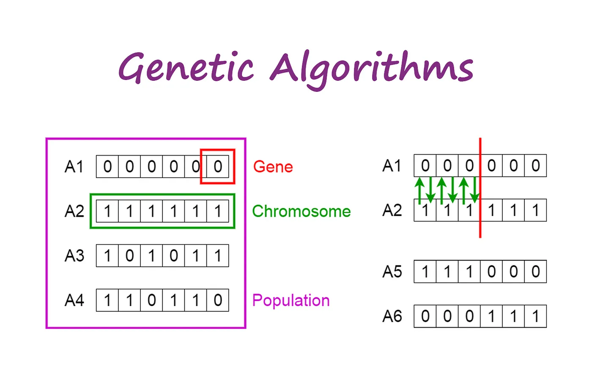

# Travelling salesman Workshop

In this workshop, we will use algorithms to find the best way to visit all the cities.

## Before Starting

You can use any programming language of your choice as long as you are comfortable with it.

## First Step:

Start by creating three new classes: `City`, `Cities`, and `Main`. Your `Main` class will use the `Cities` class to work, and `Cities` will represent the list of all cities you have.

#### City Class

The `City` class should contain three private properties:

- `ID`: City ID
- `Name`: City name
- `Lon`: Longitude of the city
- `Lat`: Latitude of the city

It should have a constructor that takes these three values as parameters.

#### Cities Class

- `cityList`: ArrayList of cities

The `Cities` class should have the following functionalities:

- `add_city(city)`: Adds a city to the list
- `remove_city(city)`: Removes a city from the
- `load_from_file(path)`: Loads the city from a file and add it to the list

> ⚠ **to go further**: you can override the function `toString()` to test the content of your objects in the future

## Second step

in the City class add a new functio call `getDistance()` that calculates the distance between this city and an other one gave in parameters using lon and lat.

## Third step

in the Cities class add a new function call `getDistanceInOrder()` that calculates the distance between all the cities in the list in order to find the value of the total distance.

Great Job ! Now you have your first result and from here we will try to determine a better distance by upgrading our algorythms

## Fourth step

Now we will upgrade our previous algorithm and not only use the order of our array.

Your objectif is by starting from the city `0` Always find the nearest city to reduce by far our traject.

Create a function in the class `Cities` called `glutton()` and test it.

this algorithm will not return the exact solution for a large number of cities but will always return a good result.

See how much better it is already !

## Fifth step

Now, we will implement the Dijkstra's algorithm to find the shortest path to travel. We will always start from `0`, which is Muret in our array.


### Dijkstra's Algorithm

My first idea was to use a common algorithm like dijkstra but a mainly problem appears to be that it was not possible. This algorithm is only efficient for graphs that have nodes with a limited number of neighbors and gave the optimized solution to go from a node A to B. Whereas we want the shortest path throught all points.


### (After a bit of wikipedia) local search algorithm


Local search algorithms are optimization techniques used to find near-optimal solutions for complex problems. Unlike global search algorithms that explore the entire solution space, local search focuses on refining an initial solution by making small, incremental changes.

However, it's important to note that local search algorithms may get stuck in local optima and not necessarily find the global optimum. Therefore, they are best suited for problems where finding a good solution quickly is more important than finding the absolute best solution.


To implement it you will start from the result of our glutton algorythm and itterate on a choose number. Each time you will make a small change in the path we take and if the result is better you keep it and use it to make small change.

```pseudo code
function LocalSearch(initialSolution):
    currentSolution = initialSolution
    currentCost = CalculateCost(currentSolution)

    while not StoppingConditionMet:
        neighborSolutions = GenerateNeighbors(currentSolution)
        bestNeighbor = null
        bestNeighborCost = currentCost

        for neighbor in neighborSolutions:
            neighborCost = CalculateCost(neighbor)
            if neighborCost < bestNeighborCost:
                bestNeighbor = neighbor
                bestNeighborCost = neighborCost

        if bestNeighborCost < currentCost:
            currentSolution = bestNeighbor
            currentCost = bestNeighborCost
        else:
            break

    return currentSolution

```

### Genetic algorithm



The next step would be to implement a genetic algorythm that create a new generation of possible path each time with small genetics modification and each time keep the best of the generation again and again. This type of algorythm is very complex and will indeed need a workshop by itself. 

[introduction to genetics algorythm](https://www.geeksforgeeks.org/genetic-algorithms/)

# Well played you have finished you now know how to find the shorter way to success 🤡